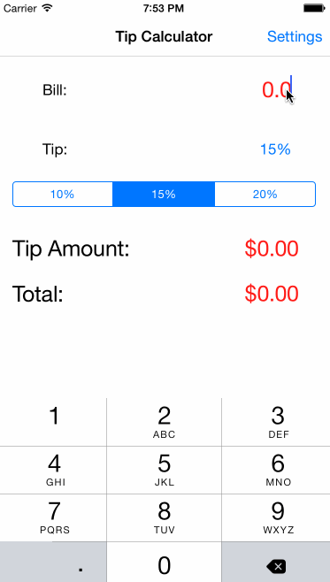

## iOSTraining_Demo1_TipCalculator
A simple tip calculator app to ramp up on iOS programming.

Time spent: 5 hours spent in total

Completed user stories:
 * [x] Required:User can input bill amount and get correct tip amount and total amount
 * [x] Required:User can conveniently select preset tip rate.
 * [x] Required:User can navigate to a Settings page and set the default tip rate.
 * [x] Optional:Use a picker view for user to select default tip rate in setting page
 * [x] Optional:Show flip up animations when tip/total amount is updated.

Notes:
Spent some time on the animation framework and 

Walkthrough of all user stories:

